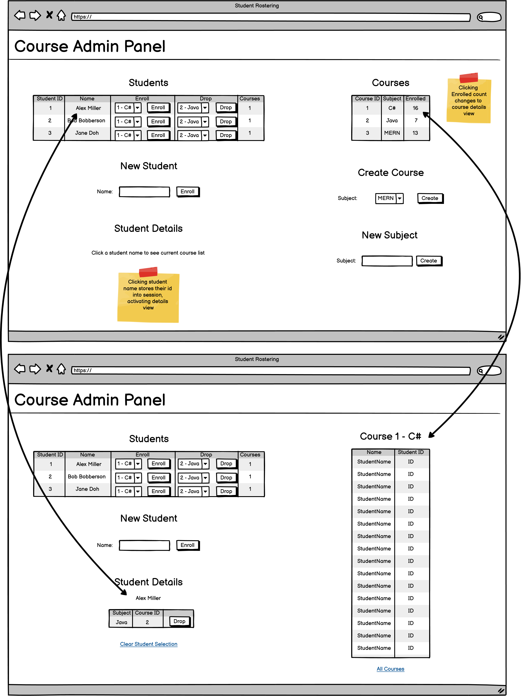
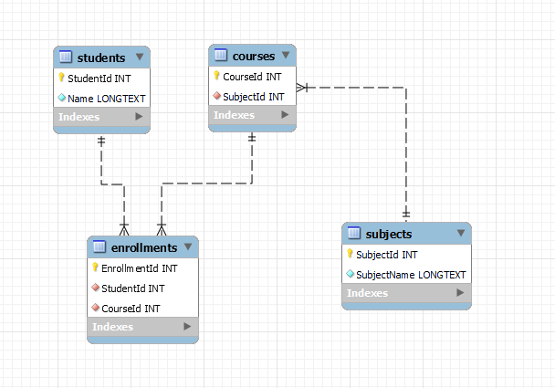

# CourseAdmin

## Brought to you by No ViewBag Gang

This learning project demonstrates intermediate usage of ViewModels to avoid any untyped data being sent to Razor files via ViewBag. This approach lowers the risk of runtime errors.

## Features

- Utilizes ViewModels for strongly-typed data
- Reduces runtime errors by avoiding ViewBag
- Demonstrates best practices in ASP.NET MVC

